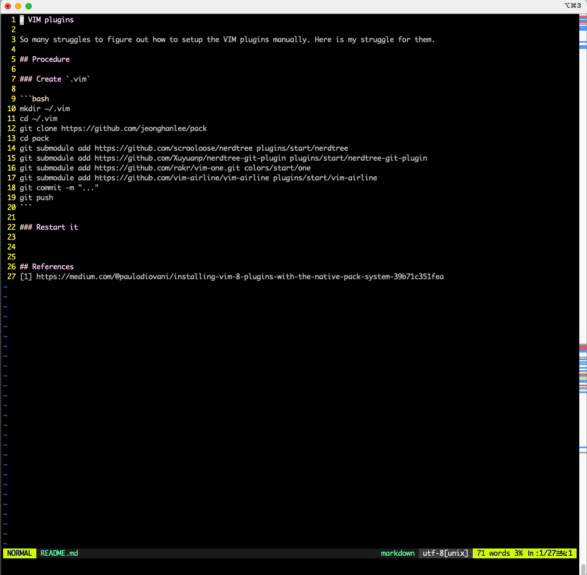

# VIM plugins

So many struggles to figure out how to setup the VIM plugins manually. Here is my struggle for them. VIM 8 is required.

## Procedure

### How to build this

```bash
mkdir ~/.vim
cd ~/.vim
git clone https://github.com/jeonghanlee/pack
cd pack
git submodule add https://github.com/scrooloose/nerdtree plugins/start/nerdtree
git submodule add https://github.com/Xuyuanp/nerdtree-git-plugin plugins/start/nerdtree-git-plugin
git submodule add https://github.com/rakr/vim-one.git colors/start/one
git submodule add https://github.com/vim-airline/vim-airline plugins/start/vim-airline
git submodule add https://github.com/voldikss/vim-floaterm plugins/start/vim-floaterm
git submodule add https://github.com/vim-syntastic/syntastic plugins/start/syntastic
git commit -m "..."
git push
```

### How to configure it

```bash
mkdir ~/.vim
cd ~/.vim
git clone https://github.com/jeonghanlee/pack
cd pack
bash init.bash
```

### Restart it

||
| :---: |
|**Figure 1** : VIM screen with the pack configuration. |

## References
[1] https://medium.com/@paulodiovani/installing-vim-8-plugins-with-the-native-pack-system-39b71c351fea
